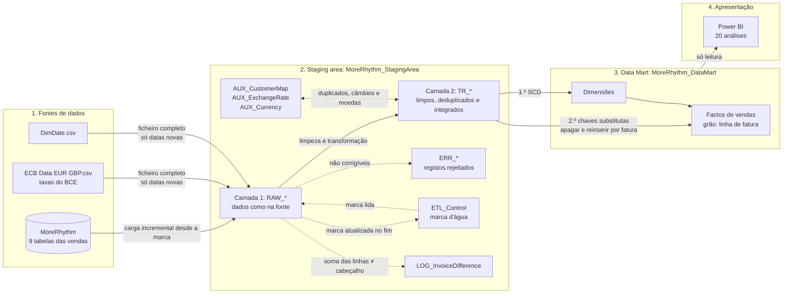
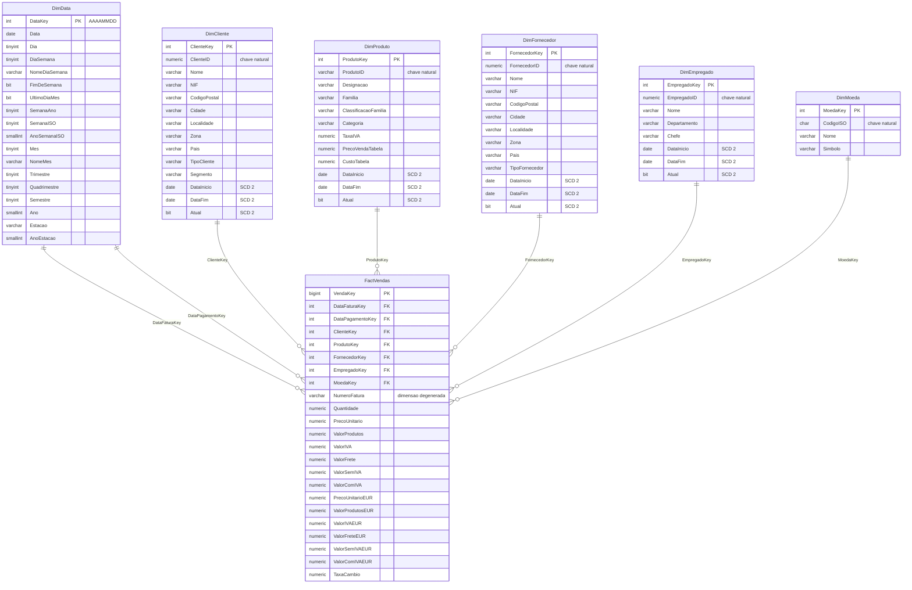

# Diagramas do relatório técnico

## Figura 1 – Arquitetura do armazém de dados da More Rhythm

```mermaid
flowchart LR
    subgraph FONTE["1. Fontes de dados"]
        direction TB
        MR[("MoreRhythm<br/>9 tabelas das vendas")]
        ECB["ECB Data EUR GBP.csv<br/>taxas do BCE"]
        DD["DimDate.csv"]
    end

    subgraph STG["2. Staging area: MoreRhythm_StagingArea"]
        direction TB
        RAW["Camada 1: RAW_*<br/>dados como na fonte"]
        TR["Camada 2: TR_*<br/>limpos, deduplicados e integrados"]
        ERR["ERR_*<br/>registos rejeitados"]
        CTRL["ETL_Control<br/>marca d'água"]
        AUX["AUX_CustomerMap<br/>AUX_ExchangeRate<br/>AUX_Currency"]
        LOG["LOG_InvoiceDifference"]
    end

    subgraph DM["3. Data Mart: MoreRhythm_DataMart"]
        direction TB
        DIM["Dimensões"]
        FACT["Factos de vendas<br/>grão: linha de fatura"]
    end

    subgraph APR["4. Apresentação"]
        PBI["Power BI<br/>20 análises"]
    end

    CTRL -. "marca lida" .-> RAW
    MR -- "carga incremental desde a marca" --> RAW
    ECB -- "ficheiro completo<br/>só datas novas" --> RAW
    DD -- "ficheiro completo<br/>só datas novas" --> RAW
    RAW -- "limpeza e transformação" --> TR
    RAW -. "não corrigíveis" .-> ERR
    RAW -. "soma das linhas ≠ cabeçalho" .-> LOG
    AUX <-. "duplicados, câmbios e moedas" .-> TR
    TR -- "1.º SCD" --> DIM
    TR -- "2.º chaves substitutas<br/>apagar e reinserir por fatura" --> FACT
    DIM --> FACT
    RAW -. "marca atualizada no fim" .-> CTRL
    DM -- "só leitura" --> PBI
```

## Modelo dimensional: MoreRhythm_DataMart (preliminar, capítulos 4 e 5)

```mermaid
erDiagram
    DimData ||--o{ FactVendas : "DataFaturaKey"
    DimData ||--o{ FactVendas : "DataPagamentoKey"
    DimCliente ||--o{ FactVendas : "ClienteKey"
    DimProduto ||--o{ FactVendas : "ProdutoKey"
    DimFornecedor ||--o{ FactVendas : "FornecedorKey"
    DimEmpregado ||--o{ FactVendas : "EmpregadoKey"
    DimMoeda ||--o{ FactVendas : "MoedaKey"

    FactVendas {
        bigint VendaKey PK
        int DataFaturaKey FK
        int DataPagamentoKey FK
        int ClienteKey FK
        int ProdutoKey FK
        int FornecedorKey FK
        int EmpregadoKey FK
        int MoedaKey FK
        varchar NumeroFatura "dimensao degenerada"
        numeric Quantidade
        numeric PrecoUnitario
        numeric ValorProdutos
        numeric ValorIVA
        numeric ValorFrete
        numeric ValorSemIVA
        numeric ValorComIVA
        numeric PrecoUnitarioEUR
        numeric ValorProdutosEUR
        numeric ValorIVAEUR
        numeric ValorFreteEUR
        numeric ValorSemIVAEUR
        numeric ValorComIVAEUR
        numeric TaxaCambio
    }
    DimData {
        int DataKey PK "AAAAMMDD"
        date Data
        tinyint Dia
        tinyint DiaSemana
        varchar NomeDiaSemana
        bit FimDeSemana
        bit UltimoDiaMes
        tinyint SemanaAno
        tinyint SemanaISO
        smallint AnoSemanaISO
        tinyint Mes
        varchar NomeMes
        tinyint Trimestre
        tinyint Quadrimestre
        tinyint Semestre
        smallint Ano
        varchar Estacao
        smallint AnoEstacao
    }
    DimCliente {
        int ClienteKey PK
        numeric ClienteID "chave natural"
        varchar Nome
        varchar NIF
        varchar CodigoPostal
        varchar Cidade
        varchar Localidade
        varchar Zona
        varchar Pais
        varchar TipoCliente
        varchar Segmento
        date DataInicio "SCD 2"
        date DataFim "SCD 2"
        bit Atual "SCD 2"
    }
    DimProduto {
        int ProdutoKey PK
        varchar ProdutoID "chave natural"
        varchar Designacao
        varchar Familia
        varchar ClassificacaoFamilia
        varchar Categoria
        numeric TaxaIVA
        numeric PrecoVendaTabela
        numeric CustoTabela
        date DataInicio "SCD 2"
        date DataFim "SCD 2"
        bit Atual "SCD 2"
    }
    DimFornecedor {
        int FornecedorKey PK
        numeric FornecedorID "chave natural"
        varchar Nome
        varchar NIF
        varchar CodigoPostal
        varchar Cidade
        varchar Localidade
        varchar Zona
        varchar Pais
        varchar TipoFornecedor
        date DataInicio "SCD 2"
        date DataFim "SCD 2"
        bit Atual "SCD 2"
    }
    DimEmpregado {
        int EmpregadoKey PK
        numeric EmpregadoID "chave natural"
        varchar Nome
        varchar Departamento
        varchar Chefe
        date DataInicio "SCD 2"
        date DataFim "SCD 2"
        bit Atual "SCD 2"
    }
    DimMoeda {
        int MoedaKey PK
        char CodigoISO "chave natural"
        varchar Nome
        varchar Simbolo
    }
```
